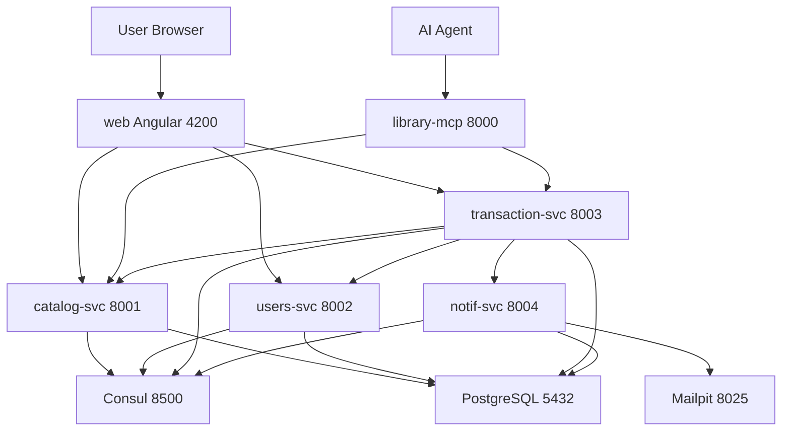

# LibriFlow - Architecture Diagram

## System Overview

## Services

| Service | Port | Responsibility |
|---------|------|----------------|
| catalog-svc | 8001 | Book catalog management |
| users-svc | 8002 | User registration, auth, JWT |
| transaction-svc | 8003 | Rentals, purchases, library access |
| notif-svc | 8004 | Notifications, email |
| library-mcp | 8000 | MCP Server for AI agents |
| consul | 8500 | Service discovery |
| postgres | 5432 | Database (4 databases) |
| mailpit | 8025 | Email capture (dev) |
| web | 4200 | Frontend |

## Communication

- **Client → Services**: HTTP/REST
- **Service → Service**: HTTP via Consul discovery
- **Service → Consul**: Registration + health checks
- **AI → MCP**: MCP Protocol
- **transaction-svc → notif-svc**: With circuit breaker + outbox pattern
