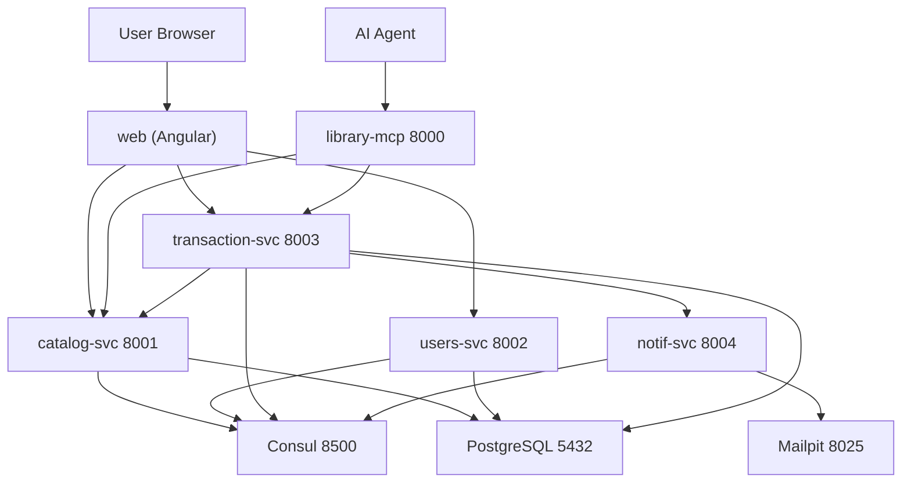

# Bookly - Architecture

## System Overview



## Services

| Service | Port | Responsibility |
|---------|------|----------------|
| library-mcp | 8000 | MCP Server for AI agents (8 tools) |
| catalog-svc | 8001 | Book catalog management (CRUD + availability) |
| users-svc | 8002 | User registration, auth, JWT |
| transaction-svc | 8003 | Rentals, purchases, library access, outbox |
| notif-svc | 8004 | Notifications, email (Mailpit) |
| orchestrator-agent | 9000 | A2A orchestrator: parses instructions, delegates |
| catalog-agent | 9001 | A2A catalog skills (search_books, get_book) |
| transaction-agent | 9002 | A2A transaction skills (rental, purchase, return) |
| notification-agent | 9003 | A2A notification skills (send, history) |
| web | 4200 (dev) / 80 (Docker) | Angular frontend |
| consul | 8500 | Service discovery |
| postgres | 5432 | Database (4 databases, one per service) |
| mailpit | 8025 | Email capture (dev) |

## A2A (Agent-to-Agent)

```
User instruction ("Buy Dune and notify me")
  └─► orchestrator-agent (9000) — parses intent, discovers agents via Agent Cards
        ├─► catalog-agent (9001)   — search_books    ──► library-mcp ──► catalog-svc
        ├─► transaction-agent (9002)— purchase_book  ──► library-mcp ──► transaction-svc
        └─► notification-agent (9003) — send_notification ──► library-mcp ──► notif-svc
```

- Each agent publishes an **Agent Card** at `/.well-known/agent.json` (name, description, skills)
- Orchestrator discovers cards (`GET /agents`) and delegates via A2A JSON-RPC (`POST /a2a/tasks/send`)
- Agents never call services directly — always through library-mcp tools

## Communication

- **Client → Services**: HTTP/REST with JWT bearer tokens
- **Service → Service**: HTTP (transaction-svc → catalog-svc for availability/price)
- **Service → Consul**: Registration + health checks
- **AI → MCP**: REST tools (`/mcp/tools/:name/execute`)
- **Agent → Agent**: A2A protocol (Agent Cards + JSON-RPC `tasks/send`)
- **Agent → Services**: exclusively via library-mcp tools
- **transaction-svc → notif-svc**: With circuit breaker + outbox pattern

## Resilience

- **Circuit breaker** around notif-svc calls: CLOSED → OPEN (3 consecutive failures) → HALF-OPEN (after 30s) → CLOSED
- **Outbox pattern**: notifications queued in `NotificationOutbox` in the same DB transaction, cron-processed every 5s (PENDING → SENT/FAILED with attempts)
- **Retry**: exponential backoff (0.5s → 2s, x2 multiplier, jitter)

## Observability

- All services emit structured JSON logs with correlation ID
- `RequestLoggingMiddleware`: one entry per HTTP call (method, path, status, duration_ms, correlation_id)
- Controllers log a `payload` object with the actual result data
- Angular `loggingInterceptor` mirrors `{service, payload}` in the browser console
- View logs: `docker compose logs -f <service>`

## Database-per-Service

| Database | User | Service |
|----------|------|---------|
| `catalog_db` | `catalog_user` | catalog-svc |
| `users_db` | `users_user` | users-svc |
| `transaction_db` | `transaction_user` | transaction-svc |
| `notif_db` | `notif_user` | notif-svc (reserved; notif-svc currently uses in-memory store) |

## Docker

- All services have multi-stage Dockerfiles in `docker/`
- `docker compose up -d` starts the full 9-container stack
- Web is served by nginx (port 80) with SPA fallback