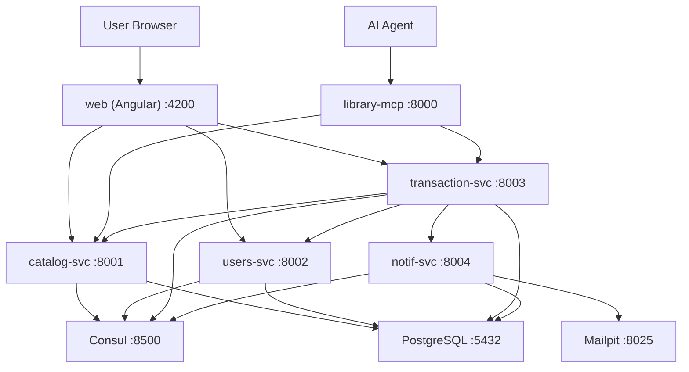
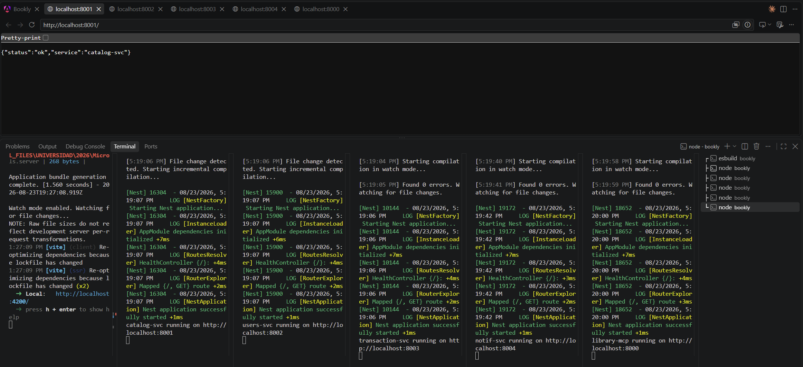
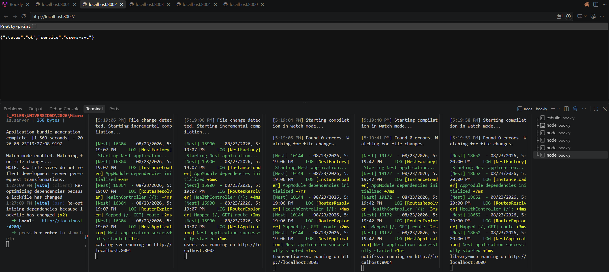
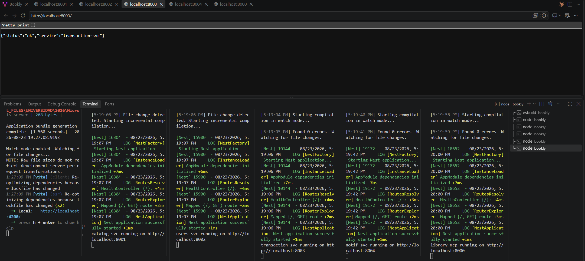
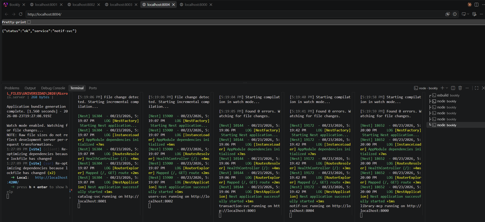
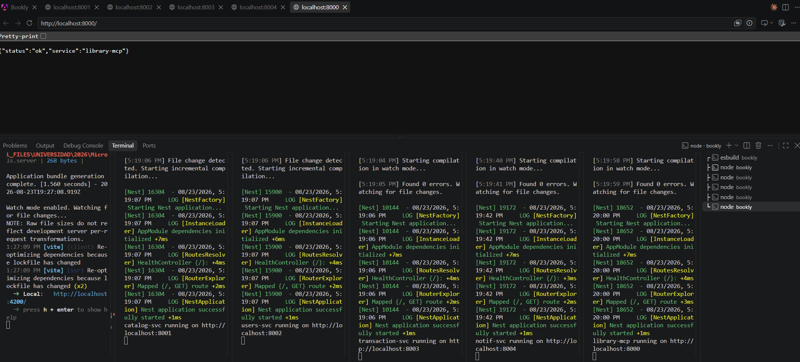

# Delivery 1 — Project Initialization and Monorepo Setup

**Bookly** is a digital library platform built with a microservices architecture. It allows users to:

- Browse a catalog of digital books
- Rent books for a period of time
- Purchase books permanently
- Access a personal library with in-app reading and PDF download

The system is designed as a learning project demonstrating key microservice patterns: direct service-to-service communication (no API Gateway), Database-per-Service, service discovery with Consul, resilience patterns (circuit breaker, outbox), structured logging with correlation IDs, AI integration via MCP, and agent coordination via A2A.

---

## 2. Tech Stack

| Layer | Technology |
|---|---|
| Frontend | Angular 21+ with Angular Material |
| Backend Services | NestJS 10 (TypeScript) |
| ORM | Prisma (planned) |
| Database | PostgreSQL 16 (single instance, four databases) |
| Service Discovery | HashiCorp Consul |
| AI Integration | MCP (Model Context Protocol) |
| Agent Protocol | A2A (Agent-to-Agent) |
| Email (local) | Mailpit |
| Containerization | Docker + Docker Compose |
| Package Manager | pnpm (monorepo workspaces) |
| Language | TypeScript (strict mode) |

---

## 3. Architecture Overview

### 3.1 High-Level Diagram



### 3.2 ASCII Architecture

```
┌─────────────────────────────────────────────────────────────┐
│                        Docker Compose                        │
│                                                              │
│  ┌─────────┐  ┌──────────┐  ┌───────────┐  ┌──────────┐   │
│  │ web     │  │ catalog  │  │ users-svc │  │ consul   │   │
│  │(Angular)│  │ -svc     │  │           │  │ :8500    │   │
│  │ :4200   │  │ :8001    │  │ :8002     │  │          │   │
│  └─────────┘  └──────────┘  └───────────┘  └──────────┘   │
│                                                              │
│  ┌─────────────┐  ┌──────────┐  ┌──────────────────┐       │
│  │transaction- │  │ notif-svc│  │ library-mcp      │       │
│  │svc          │  │          │  │                  │       │
│  │ :8003       │  │ :8004    │  │ :8000            │       │
│  └─────────────┘  └──────────┘  └──────────────────┘       │
│                                                              │
│  ┌──────────┐  ┌──────────┐  ┌──────────────────┐          │
│  │ postgres │  │ mailpit  │  │ agents :9000-9003│          │
│  │ :5432    │  │ :8025    │  │                  │          │
│  └──────────┘  └──────────┘  └──────────────────┘          │
└─────────────────────────────────────────────────────────────┘
```

### 3.3 Communication Patterns

| Pattern | Description |
|---------|-------------|
| Client → Services | HTTP/REST |
| Service → Service | HTTP via Consul service discovery |
| Service → Consul | Registration + health checks |
| AI → MCP | MCP Protocol |
| transaction-svc → notif-svc | Circuit breaker + outbox pattern |

---

## 4. Services Implemented

### 4.1 Microservices Overview

| Service | Port | Package | Description |
|---------|------|---------|-------------|
| library-mcp | 8000 | `@bookly/library-mcp` | MCP Server for AI agents |
| catalog-svc | 8001 | `@bookly/catalog-svc` | Book catalog management |
| users-svc | 8002 | `@bookly/users-svc` | User registration, auth, JWT |
| transaction-svc | 8003 | `@bookly/transaction-svc` | Rentals, purchases, library access |
| notif-svc | 8004 | `@bookly/notif-svc` | Notifications, email |

### 4.2 Each Service Returns

```json
GET / → { "status": "ok", "service": "<service-name>" }
```

### 4.3 Evidence — Service Endpoints

#### catalog-svc (port 8001)


#### users-svc (port 8002)


#### transaction-svc (port 8003)


#### notif-svc (port 8004)


#### library-mcp (port 8000)


### 4.4 Video Evidence

See [evidence.mp4](evidence.mp4) for a live demo of all services responding.

---

## 5. Project Structure

```
bookly/
├── package.json                 # Root package.json (monorepo scripts)
├── pnpm-workspace.yaml          # Workspace: apps/*, agents/*, packages/*
├── .gitignore
├── .env.example                 # Environment variable template
├── angular.json                 # Angular CLI config
├── tsconfig.json                # Root TypeScript config
├── IMPLEMENTATION_LOG.md        # Implementation tracking
│
├── apps/                        # Microservices
│   ├── catalog-svc/             # NestJS app (port 8001)
│   ├── users-svc/               # NestJS app (port 8002)
│   ├── transaction-svc/         # NestJS app (port 8003)
│   ├── notif-svc/               # NestJS app (port 8004)
│   └── library-mcp/             # NestJS app (port 8000)
│
├── packages/                    # Shared workspace packages
│   ├── config/                  # ESLint, TypeScript, Prettier configs
│   │   ├── eslint/base.js
│   │   ├── typescript/base.json
│   │   └── prettier/.prettierrc
│   ├── shared/                  # Shared types, constants, utilities
│   │   ├── types/               # User, Book, Transaction types
│   │   ├── constants/           # Ports, Events
│   │   └── utils/               # Correlation ID, Structured Logger
│   └── contracts/               # API contracts between services
│       ├── auth/
│       ├── books/
│       ├── transactions/
│       └── notifications/
│
└── src/                         # Angular frontend (root-level)
    └── app/
```

---

## 6. What Was Implemented (Delivery 1)

### 6.1 Monorepo Setup

- **Root `package.json`** with pnpm workspace scripts for all services
- **`pnpm-workspace.yaml`** defining `apps/*`, `agents/*`, `packages/*`
- **`.gitignore`** for Node.js, Docker, env files, IDE, coverage, and context docs
- **`.env.example`** with all required environment variables

### 6.2 Shared Configurations (`packages/config/`)

| File | Purpose |
|------|---------|
| `eslint/base.js` | Base ESLint config with TypeScript support |
| `typescript/base.json` | Shared TypeScript config (strict null checks, decorator support) |
| `prettier/.prettierrc` | Consistent code formatting rules |

### 6.3 Shared Types (`packages/shared/types/`)

| Type | Description |
|------|-------------|
| `User`, `CreateUserDto`, `UpdateUserDto`, `LoginDto`, `AuthResponse` | User management |
| `Book`, `CreateBookDto`, `UpdateBookDto`, `BookAvailability` | Book catalog |
| `Rental`, `Purchase`, `CreateRentalDto`, `CreatePurchaseDto`, `LibraryEntry` | Transactions |

### 6.4 Shared Constants (`packages/shared/constants/`)

- **`PORTS`** — All service port mappings (catalog: 8001, users: 8002, etc.)
- **`EVENTS`** — Notification event types (RENTAL_CREATED, PURCHASE_COMPLETED, etc.)

### 6.5 Shared Utilities (`packages/shared/utils/`)

- **`Correlation ID`** — UUID generation and header extraction for request tracing
- **`StructuredLogger`** — JSON logging class with timestamp, level, service, event, and correlation_id

### 6.6 API Contracts (`packages/contracts/`)

- **Auth** — RegisterRequest, LoginRequest, AuthResponse, UserProfile
- **Books** — Book, CreateBookRequest, SearchBooksQuery, BookAvailabilityResponse
- **Transactions** — Rental, Purchase, LibraryEntry, BookAccessResponse
- **Notifications** — NotificationType, CreateNotificationRequest, NotificationResponse

### 6.7 Placeholder Microservices

5 NestJS applications created under `apps/`, each with:
- Minimal NestJS bootstrap (`main.ts`, `app.module.ts`)
- Health check endpoint (`GET /`)
- Service-specific port binding
- TypeScript compilation verified

---

## 7. How to Test

### 7.1 Prerequisites

```bash
# Install pnpm (if not installed)
npm install -g pnpm

# Install all dependencies
cd bookly
pnpm install
```

### 7.2 Run Individual Services

```bash
# Each in a separate terminal
pnpm dev:catalog       # → http://localhost:8001
pnpm dev:users         # → http://localhost:8002
pnpm dev:transaction   # → http://localhost:8003
pnpm dev:notif         # → http://localhost:8004
pnpm dev:mcp           # → http://localhost:8000
```

### 7.3 Verify Endpoints

```bash
# PowerShell
Invoke-WebRequest http://localhost:8001
# → {"status":"ok","service":"catalog-svc"}

# Or open in browser
Start-Process http://localhost:8001
```

### 7.4 Run Angular Frontend

```bash
npm start              # → http://localhost:4200
```

---

## 8. Key Decisions

| Decision | Rationale |
|----------|-----------|
| **pnpm workspaces** | Native monorepo support, faster than npm/yarn, strict dependency resolution |
| **NestJS for backend** | Enterprise-grade, TypeScript-first, modular architecture, decorators |
| **Angular for frontend** | Component-based, TypeScript, Angular Material, SSR support |
| **Shared `packages/`** | Single source of truth for types, constants, and utilities across all services |
| **API contracts** | Type-safe inter-service communication interfaces |
| **Database-per-Service** | Each service owns its data, enabling independent scaling and evolution |

---
