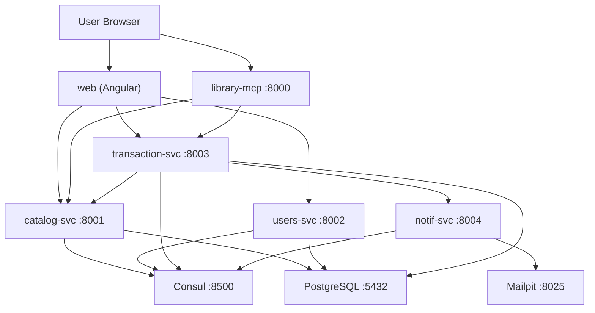

# Delivery 2 — Core Microservices, Resilience, Frontend, and Docker

**Bookly** is a digital library platform built with a microservices architecture. This delivery moves the project from placeholders to a fully functional system: four real backend microservices, an MCP server for AI agents, resilience patterns (circuit breaker + outbox), structured JSON logging with correlation IDs, an Angular frontend with Material Design, and complete Docker configuration for the whole stack.

The system is designed as a learning project demonstrating key microservice patterns: direct service-to-service communication (no API Gateway), Database-per-Service, service discovery with Consul, resilience patterns (circuit breaker, outbox, retry), structured logging with correlation IDs, AI integration via MCP, and agent coordination via A2A (Agent Cards + task delegation).

---

## 2. Tech Stack

| Layer | Technology |
|---|---|
| Frontend | Angular 21+ with Angular Material (standalone components) |
| Backend Services | NestJS 10 (TypeScript) |
| ORM | Prisma (single combined schema, one Prisma client per service) |
| Database | PostgreSQL 16 (single instance, four databases) |
| Service Discovery | HashiCorp Consul |
| AI Integration | MCP (Model Context Protocol) — library-mcp REST server |
| Agent Protocol | A2A (Agent-to-Agent) — planned |
| Email (local) | Mailpit (SMTP 1025, UI 8025) |
| Containerization | Docker + Docker Compose (multi-stage Dockerfiles) |
| Package Manager | pnpm (monorepo workspaces, `node-linker=hoisted`) |

---

## 3. Architecture Overview

### 3.1 High-Level Diagram



### 3.2 Port Map

| Service | Port | Description |
|---------|------|-------------|
| library-mcp | 8000 | MCP server exposing Bookly tools to AI agents |
| catalog-svc | 8001 | Book catalog (CRUD, availability) |
| users-svc | 8002 | Registration, login, JWT auth |
| transaction-svc | 8003 | Rentals, purchases, library, outbox |
| notif-svc | 8004 | Notifications + email (Mailpit) |
| web | 4200 (dev) / 80 (Docker) | Angular frontend |
| Consul | 8500 | Service discovery UI |
| Mailpit | 8025 (UI), 1025 (SMTP) | Email testing |
| PostgreSQL | 5432 | 4 databases (one per service) |

### 3.3 Communication Patterns

| Pattern | Description |
|---------|-------------|
| Client → Services | HTTP/REST with JWT bearer tokens |
| Service → Service | HTTP (transaction-svc → catalog-svc for availability/price) |
| Service → Consul | Registration + health checks on startup |
| AI → MCP | REST tools (`/mcp/tools/:name/execute`) |
| transaction-svc → notif-svc | Outbox pattern + circuit breaker + retry |

---

## 4. Services Implemented

### 4.1 catalog-svc (port 8001)

Book catalog microservice with Prisma ORM, CRUD endpoints, and Consul registration.

| Method | Endpoint | Auth | Description |
|--------|----------|------|-------------|
| GET | /books | Public | List books (`?genre`, `?title` filters) |
| GET | /books/:id | Public | Get book by ID |
| GET | /books/:id/availability | Public | Check availability |
| POST | /books | Internal | Create book |
| PUT | /books/:id | Internal | Update book |
| DELETE | /books/:id | Internal | Delete book (204) |
| GET | /healthz | Public | Health check |
| GET | /readyz | Public | Readiness (DB connectivity) |

#### 4.1.1 Seed Data

18 books across science-fiction, fantasy, programming, dystopian, mystery, and non-fiction genres, seeded via `infrastructure/postgres/seed.sql` and applied to the running instance.

| Book | Author | Genre | Price |
|------|--------|-------|-------|
| Dune | Frank Herbert | science-fiction | $12.99 |
| Foundation | Isaac Asimov | science-fiction | $11.99 |
| Clean Code | Robert C. Martin | programming | $14.99 |
| The Pragmatic Programmer | Andrew Hunt | programming | $15.99 |
| 1984 | George Orwell | dystopian | $9.99 |
| The Hobbit | J.R.R. Tolkien | fantasy | $10.99 |
| Brave New World | Aldous Huxley | dystopian | $11.50 |
| Neuromancer | William Gibson | science-fiction | $13.99 |
| The Name of the Wind | Patrick Rothfuss | fantasy | $12.99 |
| Designing Data-Intensive Applications | Martin Kleppmann | programming | $24.99 |
| The Girl with the Dragon Tattoo | Stieg Larsson | mystery | $10.99 |
| The Da Vinci Code | Dan Brown | mystery | $9.99 |
| Sapiens: A Brief History of Humankind | Yuval Noah Harari | non-fiction | $14.99 |
| The Martian | Andy Weir | science-fiction | $11.99 |
| The Fellowship of the Ring | J.R.R. Tolkien | fantasy | $11.99 |
| Animal Farm | George Orwell | dystopian | $8.99 |
| A Game of Thrones | George R.R. Martin | fantasy | $13.99 |
| The Selfish Gene | Richard Dawkins | non-fiction | $12.99 |

### 4.2 users-svc (port 8002)

Users + authentication microservice with JWT.

| Method | Endpoint | Auth | Description |
|--------|----------|------|-------------|
| POST | /auth/register | Public | Register user (returns JWT) |
| POST | /auth/login | Public | Login (returns JWT) |
| GET | /auth/profile | JWT | Current user profile |
| GET | /users/:id | Internal | User by ID |
| PUT | /users/:id | Internal | Update user |
| DELETE | /users/:id | Internal | Delete user (204) |
| GET | /healthz / /readyz | Public | Health + readiness |

Security features:
- Passwords hashed with **bcryptjs** (pure JS — avoids native module issues on Windows)
- Duplicate email → 409 Conflict; invalid credentials → 401 Unauthorized
- JWT with configurable expiration (`JWT_EXPIRATION=60m`), validated by Passport strategy
- Passwords never returned in responses and never logged

### 4.3 transaction-svc (port 8003)

Core business logic: rentals, purchases, unified library, outbox pattern, circuit breaker.

| Method | Endpoint | Auth | Description |
|--------|----------|------|-------------|
| POST | /rentals | JWT | Create rental (availability check, max 5 active) |
| GET | /rentals/me | JWT | List user rentals |
| GET | /rentals/:id | JWT | Rental details |
| POST | /rentals/:id/return | JWT | Return book (restores availability) |
| POST | /purchases | JWT | Purchase (price fetched from catalog-svc) |
| GET | /purchases/me | JWT | Purchase history |
| GET | /library | JWT | Merged library (rentals + purchases + book details) |
| GET | /library/:bookId/access | JWT | Book access + temporary download URL |
| GET | /healthz / /readyz | Public | Health + readiness |

Business rules enforced:
1. Book must exist to rent/purchase (checked against catalog-svc)
2. Book must be available (`availableCopies > 0`)
3. Rental duration between 1 and 30 days
4. Max 5 active rentals per user
5. Returning restores `availableCopies`
6. Expired rentals switch to `EXPIRED` status

### 4.4 notif-svc (port 8004)

Notifications microservice with email delivery via Mailpit.

| Method | Endpoint | Auth | Description |
|--------|----------|------|-------------|
| POST | /notifications | Internal | Create + send notification (email via SMTP) |
| GET | /notifications | Internal | All notifications |
| GET | /notifications/users/:userId | Internal | User history |
| GET | /notifications/:id | Internal | By ID |
| GET | /healthz / /readyz | Public | Health + readiness |

#### 4.4.1 Email Templates (Handlebars)

| Template | Event |
|----------|-------|
| `RENTAL_CREATED` | Rental created |
| `RENTAL_RETURNED` | Rental returned |
| `RENTAL_EXPIRING` | Rental about to expire |
| `PURCHASE_CONFIRMATION` | Purchase completed |
| `WELCOME` | User registered |

All emails are styled HTML with Bookly branding and captured by Mailpit at `http://localhost:8025`.

### 4.5 library-mcp (port 8000)

MCP (Model Context Protocol) server exposing Bookly capabilities to AI agents via REST.

| Method | Endpoint | Description |
|--------|----------|-------------|
| GET | /mcp/tools | List all tools |
| POST | /mcp/tools/:name/execute | Execute a tool |
| GET | /mcp/capabilities | Server capabilities |
| GET | /healthz / /readyz | Health + readiness |

| Tool | Description | Calls |
|------|-------------|-------|
| `search_books` | Search by title/genre | catalog-svc |
| `get_book` | Book details by ID | catalog-svc |
| `create_rental` | Create rental (JWT) | transaction-svc |
| `purchase_book` | Purchase book (JWT) | transaction-svc |
| `return_book` | Return rented book (JWT) | transaction-svc |
| `get_my_library` | User's library (JWT) | transaction-svc |
| `send_notification` | Send notification/email | notif-svc |
| `get_notification_history` | User's notification history | notif-svc |

> **Note:** the notification tools were added to support the A2A agent network — agents only talk to services through library-mcp.

---

## 5. A2A (Agent-to-Agent)

Specialized agents that discover each other via **Agent Cards** (`/.well-known/agent.json`) and delegate tasks using **A2A JSON-RPC** (`POST /a2a/tasks/send`) — Google's open A2A pattern applied to the microservices analogy:

| Microservices | Agents with A2A |
|---------------|-----------------|
| Cada servicio tiene una responsabilidad | Cada agente tiene una especialidad |
| Se registran en Consul (service registry) | Se publican con un Agent Card (agent registry) |
| Se descubren dinámicamente | Se descubren via Agent Cards |
| Se comunican por HTTP | Se comunican por A2A protocol |

### 5.1 Agent Network

| Agent | Port | Skills | Delegates to |
|-------|------|--------|--------------|
| orchestrator-agent | 9000 | process_instruction (NL parsing + delegation) | all other agents |
| catalog-agent | 9001 | search_books, get_book | library-mcp → catalog-svc |
| transaction-agent | 9002 | create_rental, purchase_book, return_book, get_my_library | library-mcp → transaction-svc |
| notification-agent | 9003 | send_notification, get_notification_history | library-mcp → notif-svc |

```
User: "Buy Dune and notify me"
  │
  ▼
Orchestrator Agent (:9000)
  │ Discovers agents via Agent Cards (GET /agents)
  │
  ├──► Catalog Agent (:9001) — search_books skill
  │        └──► library-mcp ──► catalog-svc
  │
  ├──► Transaction Agent (:9002) — purchase_book skill
  │        └──► library-mcp ──► transaction-svc
  │
  └──► Notification Agent (:9003) — send_notification skill
           └──► library-mcp ──► notif-svc
```

### 5.2 How to Test the Demo

```powershell
# Registry: all discovered Agent Cards
Invoke-RestMethod http://localhost:9000/agents

# Individual Agent Card
Invoke-RestMethod http://localhost:9001/.well-known/agent.json

# Login to get a JWT
$login = Invoke-RestMethod -Method Post http://localhost:8002/auth/login `
  -ContentType "application/json" -Body '{"email":"test@bookly.io","password":"Test1234!"}'

# Natural-language instruction (Spanish or English)
Invoke-RestMethod -Method Post http://localhost:9000/orchestrate `
  -ContentType "application/json" `
  -Body (@{ instruction = "Buy Dune and notify me"; authToken = $login.access_token } | ConvertTo-Json)
```

Tested instruction set: `Buy Dune and notify me` (purchase + notification), `renta Foundation` (rental), `devolver Foundation` (return by title), `buscar libros de fantasia` (genre search), `compra The Hobbit y notificame` (purchase + notify). Intent keywords are ES/EN; genres are auto-detected.

### 5.3 A2A Message Example

```json
// Request
{"jsonrpc":"2.0","id":"task-1","method":"tasks/send",
 "params":{"taskId":"task-1","message":{"role":"user",
           "parts":[{"text":"purchase_book|{\"bookId\":1}"}]}}}

// Response
{"jsonrpc":"2.0","id":"task-1",
 "result":{"taskId":"task-1","status":"completed",
           "artifacts":[{"parts":[{"text":"{\"id\":3,\"bookId\":1,...}"}]}]}}}
```

## 6. Resilience Patterns

### 5.1 Circuit Breaker

Three-state circuit breaker around the `notif-svc` call from `transaction-svc`:

```
CLOSED (normal)
   │
   │ 3 consecutive failures
   ▼
OPEN (circuit active — notifications saved to outbox)
   │
   │ 30 seconds
   ▼
HALF-OPEN (testing)
   │
   ├── Success → CLOSED
   │
   └── Failure → OPEN
```

### 5.2 Outbox Pattern

1. Rental/purchase creation writes a `NotificationOutbox` row in the **same DB transaction**
2. Cron processor (`@nestjs/schedule`, every 5s) picks up `PENDING` rows
3. Sends to notif-svc; success → `SENT`, failure → `FAILED` with `attempts` incremented
4. Guarantees no notification loss even if notif-svc is down

### 5.3 Retry with Exponential Backoff

| Config | Value |
|--------|-------|
| maxRetries | 3 |
| initialDelay | 500ms |
| maxDelay | 2000ms |
| backoffMultiplier | 2 |
| jitter | true (prevents thundering herd) |

---

## 7. Observability (Structured Logging + Correlation ID)

### 6.1 Log Format

All services emit JSON logs:

```json
{
  "timestamp": "2026-09-06T18:47:35.056Z",
  "level": "INFO",
  "service": "catalog-svc",
  "event": "http_request",
  "message": "GET /books -> 200 (8ms)",
  "method": "GET",
  "path": "/books",
  "status": 200,
  "duration_ms": 8,
  "correlation_id": "test-abc-123"
}
```

### 6.2 Three Log Layers

| Layer | What it logs | Where to see it |
|-------|-------------|-----------------|
| HTTP request middleware | Every call: method, path, status, duration, correlation ID | `docker compose logs <service>` |
| Controller business logs | Domain events with `payload` (results, counts, ids) | `docker compose logs <service>` |
| Browser console (Angular interceptor) | Same `{service, payload}` shape for every API call | DevTools Console (F12) |

Controller example:

```json
{
  "level": "INFO",
  "service": "BooksController",
  "message": "Fetching book by id",
  "payload": { "bookId": 15, "title": "The Martian" },
  "correlation_id": "9ff2c390-1c12-4d9f-932e-cf62a6ff88bd"
}
```

Browser console example (produces identical entries client-side):

```js
{service: "catalog-svc", message: "GET /books/15 -> 200 (4ms)", payload: {id: 15, title: "The Martian", ...}, correlation_id: "..."}
```

### 6.3 Correlation ID Flow

```
Browser (logs.interceptor sets x-correlation-id)
   │  x-correlation-id: uuid
   ▼
transaction-svc (CorrelationIdMiddleware echoes header)
   │  x-correlation-id: uuid (propagated on outgoing calls)
   ▼
catalog-svc / notif-svc
```

Each service runs a `CorrelationIdMiddleware` that accepts (or generates) the ID, stores it on the request, and echoes it in the response headers. Payload logs never include passwords or tokens.

---

## 8. Frontend (Angular + Material)

Angular 21 application (standalone components, no NgModules for features) with Angular Material 3 theming, located at the monorepo root `src/`.

### 7.1 Pages

| Page | Route | Description |
|------|-------|-------------|
| Catalog | `/catalog` | Book grid with search + genre filter |
| Book Detail | `/catalog/:id` | Full info, Rent / Buy buttons |
| Cart | `/cart` | Items with checkout (mixed rent/buy) |
| Library | `/library` | Rented/owned books with return + access |
| Login / Register | `/auth/*` | Material forms |
| Profile | `/profile` | User information |

### 7.2 Core Infrastructure

| Piece | File(s) | Purpose |
|-------|---------|---------|
| Services | `core/services/` (auth, catalog, transaction, cart) | API clients + cart state via signals |
| Interceptors | `core/interceptors/` (auth, correlation-id, logging) | JWT injection, tracing, browser console logs |
| Guard | `core/guards/auth.guard.ts` | Protects authenticated routes |
| Shared components | `shared/components/` (book-card, loading-spinner) | Reusable UI |
| Layout | `layout/` (header + layout wrapper) | Toolbar with nav, cart badge, user menu |
| Routing | `app.routes.ts` + feature `*.routes.ts` | Lazy-loaded feature routes |

### 7.3 CORS

All services enable CORS (`origin: true`, `Authorization`/`Content-Type`/`x-correlation-id` headers) so the app works both from `http://localhost:4200` (dev) and `http://localhost` (Docker nginx). Verified with preflight `OPTIONS` returning `204` + `Access-Control-Allow-Origin`.

---

## 9. Docker Configuration

### 8.1 Dockerfiles

| File | Builds |
|------|--------|
| `docker/Dockerfile.nestjs` | Multi-stage (deps → shared → service → slim production) — parameterized by `SERVICE_NAME` build arg for all 5 services |
| `docker/Dockerfile.web` | Multi-stage Angular build → nginx static hosting |
| `docker/nginx.conf` | SPA fallback to `index.html` |

Key Dockerfile details:
- `corepack` enables pnpm inside the image
- `ENV SERVICE_NAME=${SERVICE_NAME}` makes the runtime CMD resolve the correct dist path
- Prisma generate runs only if the service has a schema (notif-svc and library-mcp skip it)

### 8.2 docker-compose Services

| Service | Port | Depends on |
|---------|------|------------|
| postgres | 5432 | — |
| consul | 8500 | — |
| mailpit | 1025, 8025 | — |
| catalog-svc | 8001 | postgres (healthy), consul (healthy) |
| users-svc | 8002 | postgres, consul |
| transaction-svc | 8003 | postgres, consul, catalog-svc |
| notif-svc | 8004 | consul, mailpit |
| library-mcp | 8000 | consul, catalog-svc, transaction-svc |
| web | 80 | catalog-svc, users-svc, transaction-svc |

### 8.3 How to Run the Full Stack

```bash
cd Librio/bookly
docker compose up -d
```

All 9 containers start in dependency order thanks to health checks. Verify with:

```bash
docker compose ps
```

| URL | What |
|-----|------|
| http://localhost | Web app |
| http://localhost:8500 | Consul UI (all 5 services registered) |
| http://localhost:8025 | Mailpit (captured emails) |

### 8.4 Common Commands

```powershell
# Logs (JSON, includes http_request + payload entries)
docker compose logs -f catalog-svc      # or users-svc / transaction-svc / notif-svc / library-mcp

# Stop everything (data preserved)
docker compose down

# Fresh database (re-runs init + seed)
docker compose down -v && docker compose up -d
```

---

## 10. Key Decisions

| Decision | Rationale |
|----------|-----------|
| **bcrypt → bcryptjs** | Native `bcrypt` fails in background processes on Windows; `bcryptjs` is pure JS and identical API |
| **Combined Prisma schema at root** | `node-linker=hoisted` overwrites per-service generated clients; a single `prisma/schema.prisma` with all models solves cross-service type resolution |
| **`node-linker=hoisted` in `.npmrc`** | Required for TypeScript to resolve `@prisma/client` across workspaces |
| **`npx tsc -p` for notif-svc and library-mcp** | `nest` CLI can't run from app dirs with the hoisted linker; direct tsc works |
| **In-memory store for notif-svc** | Notification history lives in memory; durable delivery is the responsibility of transaction-svc's outbox pattern |
| **MCP tools via REST** | Exposes standardized tool interface (`/mcp/tools/:name/execute`) without requiring an MCP client library |
| **Angular standalone components** | Modern Angular 21 style; lazy-loaded route arrays instead of feature NgModules |
| **CORS enabled per service** | Frontend runs on a different origin (4200/80) than the services (8000–8004) |
| **Request logging middleware** | One JSON line per HTTP call (method, path, status, duration, correlation ID) with a `payload` field in every controller log |
| **`ENV SERVICE_NAME` in Dockerfile** | Build args don't exist at runtime; converting to ENV fixed `Cannot find module /app/apps/dist/main.js` |

---

## 11. Evidence

A live demonstration of the complete system is available on video: **[Deliveries\Delivery-2\evidence_delivery-2.mp4](evidence_delivery-2.mp4)**.

### What the demo covers

1. All 9 containers running (`docker compose ps`)
2. Web app at `http://localhost`: catalog with 18 books, book detail page
3. Registration + login (users-svc) returning JWT
4. Rental and purchase flows (transaction-svc) with business-rule checks
5. Library view showing rented/owned books
6. Emails captured in Mailpit UI (8025)
7. All 5 services registered and healthy in Consul UI (8500)
8. JSON logs with `{service, payload}` in container logs and browser DevTools console
9. MCP tools listed and executed (`/mcp/tools`, `/mcp/capabilities`)

### Quick manual verification

```powershell
# Catalog shows 18 seeded books
Invoke-RestMethod http://localhost:8001/books | Measure-Object

# Register + login
Invoke-RestMethod -Method Post http://localhost:8002/auth/register `
  -ContentType "application/json" `
  -Body '{"name":"Test","email":"test@bookly.io","password":"Test1234!"}'

# Rent a book (use token from login)
Invoke-RestMethod -Method Post http://localhost:8003/rentals `
  -Headers @{ Authorization = "Bearer <token>" } `
  -ContentType "application/json" `
  -Body '{"bookId":1,"durationDays":7}'

# MCP capabilities
Invoke-RestMethod http://localhost:8000/mcp/capabilities
```

---

## 12. Endpoint Classification

| Endpoint | Type |
|----------|------|
| GET /books, GET /books/:id, GET /books/:id/availability | Public |
| POST /auth/register, POST /auth/login, GET /auth/profile | Public (profile requires JWT) |
| POST /rentals, GET /rentals/*, POST /purchases, GET /purchases/me, GET /library* | JWT |
| POST /notifications, GET /notifications* | Internal |
| POST /books, PUT /books/:id, DELETE /books/:id | Internal |
| /mcp/tools, /mcp/tools/:name/execute, /mcp/capabilities | Public (JWT passed as tool param for protected tools) |

