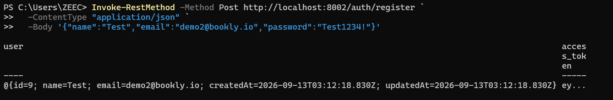
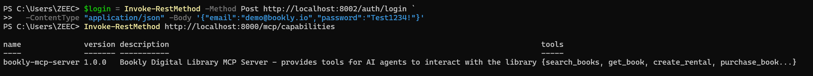
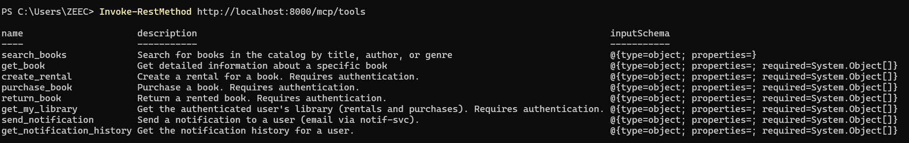
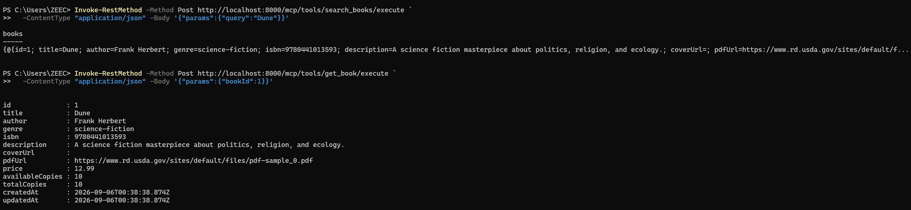
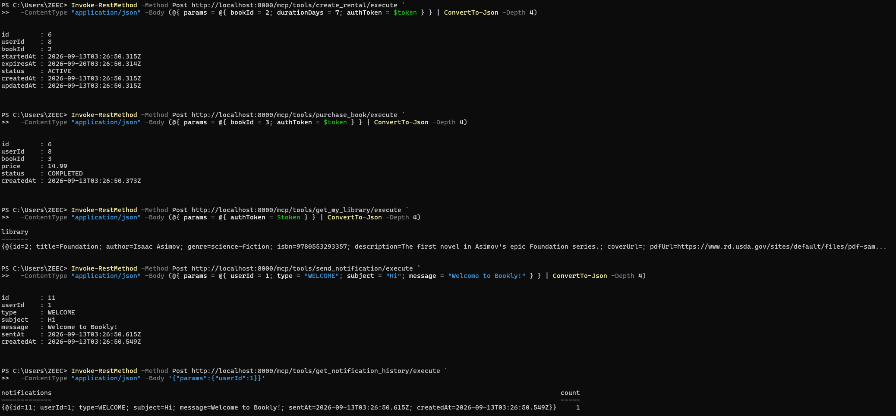
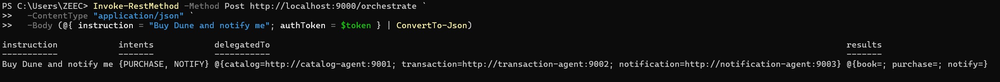
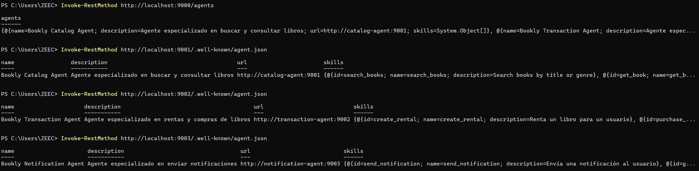
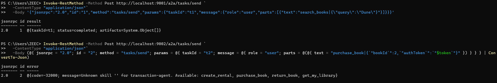
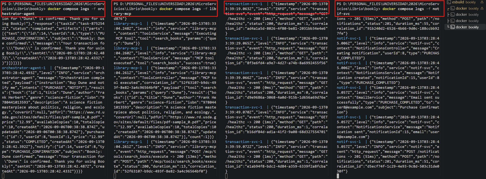

# Delivery Final — MCP & A2A Integration

**Bookly** is a digital library platform built with a microservices architecture. This final delivery focuses on the AI integration layer: the **MCP (Model Context Protocol)** server that exposes Bookly's capabilities to AI agents, and the **A2A (Agent-to-Agent)** network of specialized agents that discover each other via Agent Cards and delegate tasks using Google's A2A protocol.

The system is designed as a learning project demonstrating key microservice patterns: direct service-to-service communication (no API Gateway), Database-per-Service, service discovery with Consul, resilience patterns (circuit breaker, outbox, retry), structured logging with correlation IDs, AI integration via MCP, and agent coordination via A2A.

---

## 1. MCP vs A2A — Key Concepts

| Question | Protocol | Answer |
|----------|----------|--------|
| ¿Cómo un agente usa un sistema externo? | **MCP** | An agent (e.g., Claude) talks to Bookly through the MCP server (`library-mcp`), which exposes the system as **tools** |
| ¿Cómo un agente delega trabajo a otro agente? | **A2A** | Specialized agents (catalog, transaction, notification) publish **Agent Cards**, discover each other, and **delegate tasks** via A2A JSON-RPC |

Analogy with microservices:

| Microservices | Agents with A2A |
|---------------|-----------------|
| Cada servicio tiene una responsabilidad | Cada agente tiene una especialidad |
| Se registran en Consul (service registry) | Se publican con un Agent Card (agent registry) |
| Se descubren dinámicamente | Se descubren via Agent Cards |
| Se comunican por HTTP | Se comunican por A2A protocol |

**Architecture rule:** agents never call services directly — they always go through `library-mcp` tools.

---

## 2. MCP (library-mcp :8000)

### 2.1 Endpoints

| Method | Endpoint | Description |
|--------|----------|-------------|
| GET | /mcp/tools | List all tools with input schemas |
| POST | /mcp/tools/:name/execute | Execute a tool |
| GET | /mcp/capabilities | Server name, version, tool list |
| GET | /healthz, /readyz | Health + readiness |

### 2.2 Tools (8)

| Tool | Description | Calls |
|------|-------------|-------|
| `search_books` | Search by title/genre | catalog-svc |
| `get_book` | Book details by ID | catalog-svc |
| `create_rental` | Create rental (JWT) | transaction-svc |
| `purchase_book` | Purchase book (JWT) | transaction-svc |
| `return_book` | Return rented book (JWT) | transaction-svc |
| `get_my_library` | User's library (JWT) | transaction-svc |
| `send_notification` | Send notification/email | notif-svc |
| `get_notification_history` | User's notification history | notif-svc |

### 2.3 How to Test (PowerShell)

```powershell
$login = Invoke-RestMethod -Method Post http://localhost:8002/auth/login `
  -ContentType "application/json" -Body '{"email":"demo@bookly.io","password":"Test1234!"}'
$token = $login.access_token

# Capabilities + tools
Invoke-RestMethod http://localhost:8000/mcp/capabilities
Invoke-RestMethod http://localhost:8000/mcp/tools

# Anonymous: search + get
Invoke-RestMethod -Method Post http://localhost:8000/mcp/tools/search_books/execute `
  -ContentType "application/json" -Body '{"params":{"query":"Dune"}}'
Invoke-RestMethod -Method Post http://localhost:8000/mcp/tools/get_book/execute `
  -ContentType "application/json" -Body '{"params":{"bookId":1}}'

# Authenticated: rent, purchase, library
Invoke-RestMethod -Method Post http://localhost:8000/mcp/tools/create_rental/execute `
  -ContentType "application/json" `
  -Body (@{ params = @{ bookId = 2; durationDays = 7; authToken = $token } } | ConvertTo-Json -Depth 4)
Invoke-RestMethod -Method Post http://localhost:8000/mcp/tools/purchase_book/execute `
  -ContentType "application/json" `
  -Body (@{ params = @{ bookId = 3; authToken = $token } } | ConvertTo-Json -Depth 4)
Invoke-RestMethod -Method Post http://localhost:8000/mcp/tools/get_my_library/execute `
  -ContentType "application/json" `
  -Body (@{ params = @{ authToken = $token } } | ConvertTo-Json -Depth 4)

# Notifications
Invoke-RestMethod -Method Post http://localhost:8000/mcp/tools/send_notification/execute `
  -ContentType "application/json" `
  -Body (@{ params = @{ userId = 1; type = "WELCOME"; subject = "Hi"; message = "Welcome to Bookly!" } } | ConvertTo-Json -Depth 4)
Invoke-RestMethod -Method Post http://localhost:8000/mcp/tools/get_notification_history/execute `
  -ContentType "application/json" -Body '{"params":{"userId":1}}'
```

---

## 3. A2A (Agent-to-Agent)

### 3.1 Agent Network

| Agent | Port | Agent Card | Skills | Delegates to |
|-------|------|------------|--------|--------------|
| orchestrator-agent | 9000 | `.well-known/agent.json` | process_instruction (natural-language parsing + delegation) | all other agents |
| catalog-agent | 9001 | `.well-known/agent.json` | search_books, get_book | library-mcp → catalog-svc |
| transaction-agent | 9002 | `.well-known/agent.json` | create_rental, purchase_book, return_book, get_my_library | library-mcp → transaction-svc |
| notification-agent | 9003 | `.well-known/agent.json` | send_notification, get_notification_history | library-mcp → notif-svc |

```
User: "Buy Dune and notify me"
  │
  ▼
Orchestrator Agent (:9000)
  │ Discovers agents via Agent Cards (GET /agents)
  │
  ├──► Catalog Agent (:9001) — search_books skill
  │        └──► library-mcp ──► catalog-svc
  │
  ├──► Transaction Agent (:9002) — purchase_book skill
  │        └──► library-mcp ──► transaction-svc
  │
  └──► Notification Agent (:9003) — send_notification skill
           └──► library-mcp ──► notif-svc
```

### 3.2 A2A Protocol Messages

Each agent exposes `POST /a2a/tasks/send` (JSON-RPC 2.0). Skills are passed as text envelopes: `skill|jsonParams`.

```json
// Request
{"jsonrpc":"2.0","id":"task-1","method":"tasks/send",
 "params":{"taskId":"task-1","message":{"role":"user",
           "parts":[{"text":"purchase_book|{\"bookId\":1}"}]}}}

// Response
{"jsonrpc":"2.0","id":"task-1",
 "result":{"taskId":"task-1","status":"completed",
           "artifacts":[{"parts":[{"text":"{\"id\":3,\"bookId\":1,...}"}]}]}}}
```

### 3.3 How to Test

```powershell
# Registry — orchestrator discovers all Agent Cards
Invoke-RestMethod http://localhost:9000/agents

# Individual Agent Cards
Invoke-RestMethod http://localhost:9001/.well-known/agent.json
Invoke-RestMethod http://localhost:9002/.well-known/agent.json
Invoke-RestMethod http://localhost:9003/.well-known/agent.json

# Natural-language orchestration (the headline demo)
$login = Invoke-RestMethod -Method Post http://localhost:8002/auth/login `
  -ContentType "application/json" -Body '{"email":"demo@bookly.io","password":"Test1234!"}'

Invoke-RestMethod -Method Post http://localhost:9000/orchestrate `
  -ContentType "application/json" `
  -Body (@{ instruction = "Buy Dune and notify me"; authToken = $login.access_token } | ConvertTo-Json)

# More verified instructions
#   "renta Foundation"            → creates a rental
#   "devolver Foundation"         → returns that rental
#   "buscar libros de fantasia"   → genre search (4 fantasy books)
#   "compra The Hobbit y notificame" → purchase + notification
```

Supported intents (ES/EN): SEARCH (buscar/search), RENT (renta/alquilar/rent), PURCHASE (compra/buy), RETURN (devolver/return), NOTIFY (notifica/notify). Genres are auto-detected (fantasia→fantasy, ciencia ficcion→science-fiction, misterio→mystery, etc.).

### 3.4 Orchestrator Endpoints

| Method | Endpoint | Description |
|--------|----------|-------------|
| POST | /orchestrate | `{instruction, authToken?}` → parses intent, resolves book, delegates to agents, aggregates results |
| GET | /agents | Registry: all discovered Agent Cards |
| GET | /.well-known/agent.json | Orchestrator's own Agent Card |

### 3.5 Security

JWT tokens are **redacted** in every agent/MCP log payload (`authToken: "***"`).

---

## 4. Observability — Traces

The entire delegation chain is observable through structured JSON logs with correlation IDs: orchestrator → specialist agent → library-mcp → service.

```json
{"timestamp":"...","level":"INFO","service":"orchestrator-agent","message":"A2A task delegated",
 "payload":{"to":"http://transaction-agent:9002","skill":"purchase_book",
            "params":{"bookId":1,"authToken":"***"},"response":{"taskId":"task-...","status":"completed","artifacts":[...]}}}
```

```powershell
docker compose logs -f orchestrator-agent   # delegation steps + payloads
docker compose logs -f catalog-agent        # skills executed
docker compose logs -f library-mcp          # tools hit underneath
docker compose logs -f transaction-svc      # rentals/purchases created
docker compose logs -f notif-svc            # emails sent (see Mailpit :8025)
```

---

## 5. Evidence

### 5.1 Screenshots — MCP

#### Capabilities + Tools (`/mcp/capabilities`, `/mcp/tools`)



#### `search_books` tool execution



#### `get_book` tool execution — book details



### 5.2 Screenshots — A2A

#### Agent Cards + Registry (`/.well-known/agent.json`, `GET /agents`)



#### `orchestrate` — "Buy Dune and notify me" (intents + delegated results)



#### Orchestrator delegation log (A2A task → transaction-agent)



#### Library after orchestrated purchase/rental



#### Notification received (Mailpit UI)



### 5.3 Screenshots — Traces

#### End-to-end trace with correlation IDs



### 5.4 Video Evidence

See **[evidence.mp4](evidence.mp4)** for a live demonstration of the MCP tools and the A2A orchestration flow (registration → login → "Buy Dune and notify me" → delegation chain → email notification).

---

## 6. Run the Full Stack

```bash
cd Librio/bookly
docker compose up -d        # 13 containers: infra + 5 services + web + 4 agents
```

| URL | What |
|-----|------|
| http://localhost | Web app (Angular) |
| http://localhost:8000 | library-mcp (MCP tools) |
| http://localhost:9000 | orchestrator-agent (A2A) |
| http://localhost:8500 | Consul UI |
| http://localhost:8025 | Mailpit UI |